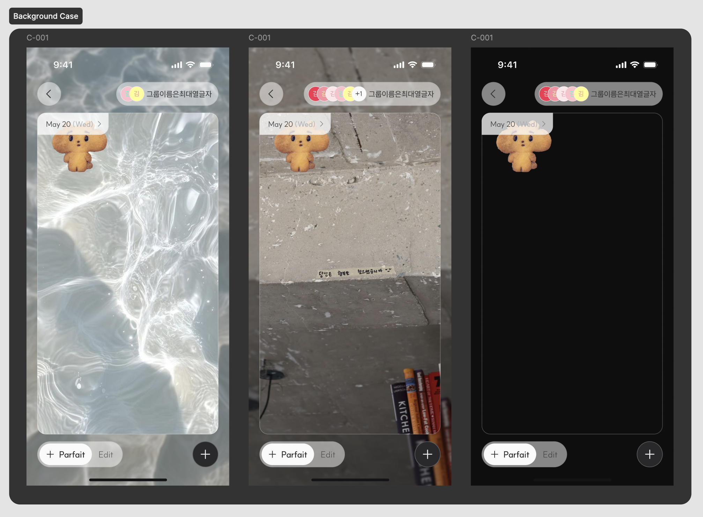

# 캔버스 정책 (C-001)

- **날짜**: 2026-07-09
- **버전**: v0.1
- **작성자**: DSN-A
- **텍스트**: C-001 그룹 캔버스의 반응형 레이아웃 및 Background Blur 정책
- **출처**: 정책 이미지 1장 + Background Case 목업 1장 (스크린샷 2026-07-13)
- **적용 화면**: C-001 (그룹 기존 캔버스 노출 · 메인). 참고 `raw/기능정의서-v5.md`

> 🔒 **실명 마스킹됨**: public repo이므로 작성자 실명을 역할 코드(DSN-A)로 마스킹함.
> 코드→실명 매핑은 git 추적 제외 위치 `wiki/personal-private/담당자-매핑.md`에 보관. CLAUDE.md 공통규칙 6 참고.

## 개정이력

| 버전 | 날짜 | 내용 |
| --- | --- | --- |
| v0.1 | 2026-07-09 | 초안 작성 |

---

# 1. 캔버스 반응형 정책

**세로 모드 전용. 태블릿·가로모드 미고려.**

## 1.1 탑바 / 탭바
- 상단(탑바), 하단(탭바) 모두 **플로팅 버튼 형태**로 화면 상/하단에 고정.
- 좌우 패딩 **20px 고정**.

## 1.2 날짜 라벨 (예: `May 20 (Wed)`)
- 크기 고정 (화면 크기와 무관하게 스케일 안 됨).
- 위치는 **캔버스 기준 좌상단 고정**.

## 1.3 캔버스 크기 및 위치

### 우선순위
1. **16:9 비율 무조건 유지**
2. 탑바–탭바 사이 상하 **최소 gap 12px 보장**
3. 좌우 패딩 **20px 유지** (가능한 한도 내에서)

### 배치
- 탑바 – 탭바 사이 **세로 중앙 정렬**.
- 상단 갭과 하단 갭은 **항상 동일한 값**으로 유지, **최소 12px 보장**.
- **평소(세로 공간 충분)**: 좌우 패딩 20px 그대로 유지 → 캔버스 너비 = 탑바/탭바와 동일.
- **예외(가로가 상대적으로 넓어 세로 공간 부족)**: 12px gap을 우선 보장하기 위해 캔버스가 축소되고, 좌우 패딩이 20px보다 커짐 → 캔버스가 탑바/탭바보다 좁아 보일 수 있음.

## 1.4 내부 요소 스케일링
- 캔버스 내부의 모든 요소는 캔버스 크기 변화에 **비례하여 동일한 비율로 스케일**(커지거나 작아짐).

---

# 2. Background Blur 정책

- 배경 유무나 종류(이미지/단색 등)와 상관없이, **어떤 상태에서든 항상 배경 전체를 덮는 크기의 Background Blur 도형을 별도 레이어로 적용**한다.
- 해당 도형 설정값:
    - **Fill**: Transparency/Black-25
    - **Effect**: Background blur
    - **Blur 방식**: Uniform
    - **Blur 값**: 4

---

# 3. 참고 이미지

배경 종류별 케이스(물 이미지 / 콘크리트 이미지 / 검정 단색) — 어떤 배경이든 Background Blur 도형이 동일하게 적용됨을 보여주는 목업.

