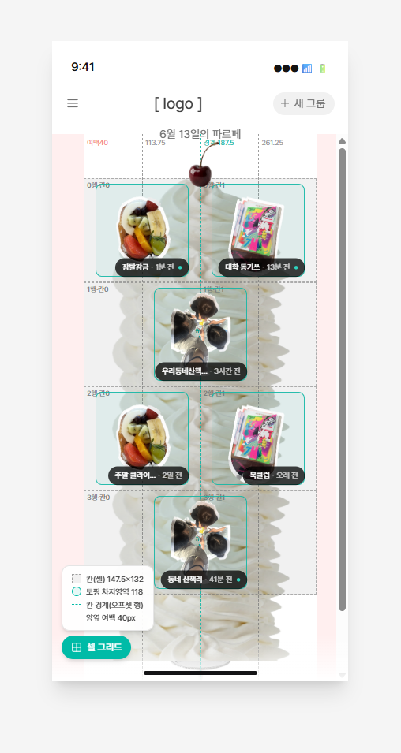

# 무한 파르페 정책 설계 (G-001)

- **날짜**: 2026-06-13 (시뮬레이션 캡처 기준)
- **텍스트**: G-001 그룹 목록 메인 화면 정책 설계서
- **출처**: Notion 페이지 export (`ExportBlock-ddd3b0a2...`) + 이미지 2장
- **적용 화면**: G-001 (그룹 메인/리스트 화면) — 참고 `raw/기능정의서-v5.md`

> 🔒 **실명 마스킹됨**: public repo이므로 3장 "정렬 기준 투표"의 팀원 실명을 역할 코드
> (DSN-*/iOS-*/AOS-*/SPR-*)로 마스킹함. 코드→실명 매핑은 git 추적 제외 위치
> `wiki/personal-private/담당자-매핑.md`에 보관. CLAUDE.md 공통규칙 6 참고.

> 그룹 목록 메인 화면. 그룹이 늘수록 파르페 템플릿이 아래로 무한히 길어지고,
> 각 그룹의 최신 대표 토핑이 **`2-1-2-1 스태거 패턴`**으로 크림 위에 쌓인다.

---

# 1. 개요

| 항목 | 내용 |
| --- | --- |
| 문서명 | 무한 스크롤 정책서 |
| 적용 플랫폼 | Android, iOS |
| 적용 화면 | 그룹 메인 화면 / 리스트 화면 |

---

# 2. 데이터 모델

조회시 가져오는 필드는 다음으로 한정한다. (수정 가능)

| 필드 | 설명 |
| --- | --- |
| 그룹 ID | 그룹 고유 식별자 |
| 프리뷰 이미지 | 그룹 대표 이미지 (토핑) |
| 이름 | 그룹 이름 |
| 활동 시간 | 최근 활동 시각 |

---

# 3. 조회 정책

- 그룹 목록은 한 번의 API 호출로 전체를 조회
    - 페이지네이션 x
- 정렬 기준
    - **가입순 (그룹에 들어온 순서) ? or 활동순? 이름순?**
    - 투표: **원하는 형식에 이름 적기**. 안 적은 사람은 문서 미열람 간주, 벌금 규칙 있음.
        - 가입순
        - **활동순** — AOS-C, iOS-A, AOS-A, DSN-B, SPR-A, DSN-A, AOS-B, SPR-B, SPR-C (9명 선택)
            - AOS-A) 자주 보는 게 위로 올라와야 편의성에 좋을 것 같은데 그러려면 활동순이 좋을 것 같음
        - 이름순

---

# 4. 상태별 동작 정의

| 상태 | 화면 표현 | 비고 |
| --- | --- | --- |
| 초기 로딩 | 로딩 인디케이터 OR 스켈레톤 UI | 화면 동작 불가/가능 |
| 조회 성공 | 전체 리스트 표시 + 스크롤 가능 | 정상 |
| 그룹 조회 0건 | G-001 Empty Case |  |
| 조회 실패 | G-001 Error Case + 새로고침 버튼 |  |

---

# 5. 갱신(새로고침) 정책

- Pull-to-Refresh로 전체 목록 다시 조회
- 새로고침 시 기존 리스트를 전체 교체하며 스크롤 위치는 최상단으로 초기화
- 화면 재진입 시 최신 활동 시간 반영을 위해 자동 재조회 여부는 정의에 따름

## 5.1 그룹 나가기 정책

- 그룹 나가기 → 해당 토핑이 목록에서 빠짐.
- **빈자리 없음:** 나간 토핑 위치 뒤의 토핑들이 가입순 그대로 한 칸씩 위로 당겨짐.
- N → N−1 로 2-1-2-1 패턴 전체 재계산 → 마지막 행 모양·전체 행수가 바뀔 수 있음.
- 크림은 그만큼 수축, 접시가 위로 올라옴.
- **반영 시점:** 저장·화면 재진입 시 (실시간 아님 — 기존 동기화 정책).

---

# 6. 초기 그룹 정보 조회 실패시 정책

에러페이지

---

# 7. 캐싱 정책

- 프리뷰 이미지
    - 지연 로딩 + 캐싱
- ~~그룹~~
    - ~~캐싱 할건지?~~

---

# 8. 그리드 배치 정책

## 8.1 배치 패턴

- 리스트는 2 - 1 - 2 - 1 - 2 - 1 … - 1 패턴으로 반복 배치
- 1행은 2개, 다음 행은 1개가 번갈아 나타남
- 2열일 시 왼→오 순으로 배치

> 💡
> ```
> [ A ][ B ]   ← 2열
> [    C    ]   ← 1열 (full-width)
> [ D ][ E ]   ← 2열
> [    F    ]   ← 1열
> ...
> ```

### 논의 필요 사항

- 2열, 1열 → 네이밍 필요할듯
    - 제안
        - 2열
        - 1열

### 저개수 특수 배치

- **N = 0** → 토핑 없음. 크림 최소 + 접시. 크림 중앙(상단 42% 지점)에 빈 상태 안내
`"첫 그룹을 만들어 / 파르페를 쌓아보세요"`
- **N = 1** → 가운데 1개

## 8.2 인덱스 기반 규칙

아이템 순서를 0부터 셀 때, 2-1 패턴은 3개 단위 반복

| 그룹 내 위치 (index % 3) | 컬럼 수 | span |
| --- | --- | --- |
| 0 | 2열 중 좌측 | 1 |
| 1 | 2열 중 좌측 | 1 |
| 2 | 1열 | 2 |

## 8.3 끝 처리 (홀수/마지막 케이스)

- 마지막 행이 2열 자리에 1개만 남는 경우
    - 해당 아이템은 좌측 1칸만 채우고 우측은 비움 (좌측 정렬)
- 마지막이 1열로 끝나는 것이 자연스러우나, 데이터 개수에 따라 2열에서 끝날 수 있음

---

# 9. 요소 정책

## 9.1 체리

- 차후 기능이 생길 수 있음
- TBD

## 9.2 토핑

이미지 뷰어 정책 정하기 다음에.. 누군가 정해야 함

프리뷰 이미지 사이즈는 디자인이 원하는 고정 사이즈로 한다 (가변 사이즈 아님)

클릭 시 개별 토핑을 잡고 있는 C-001로 이동

## 9.3 라벨

### 그룹 이름 글자수 처리

칩(라벨 pill)은 한 줄 고정, 토핑 우측 하단 배치.

- **최대 노출: 6자 (한글 기준)**
- **7자 이상 → 앞 5자 + `…`** (예: `우리동네산책모임` → `우리동네산…`)
- 시간 텍스트(`· N분 전`)는 항상 전체 노출, 줄이지 않음
- 칩 폭은 토핑 폭에 종속시키지 않고 내용 기준으로 늘어남

### 상대 시간 표기 기준

대표 토핑의 **마지막 활동 시각** 기준으로 표기.

| 경과 시간 | 표기 |
| --- | --- |
| 60초 미만 | **방금 전** |
| 1분 ~ 59분 | **N분 전** |
| 1시간 ~ 23시간 | **N시간 전** |
| 1일 ~ 6일 | **N일 전** |
| 7일 이상 | **오래 전** |

### NEW 기준

- 규칙
    - 그룹을 무조건 선택해야 읽은 것으로 판단 (C-001 진입 필요)
    - 그룹이 스크린에 나오는 것만으로 라벨에 뉴 표시가 사라지는 것이 아님
- ~~캐싱할 경우 논의 필요 사항~~
    - **보조 규칙(서버 unread 데이터 없을 때 폴백):** `lastActivityAt` 가 **24시간 이내**면 NEW

## 9.4 크림

콘텐츠 패딩이 있어야 함. 수치는 디자인 하면서 정해질 예정.

- 크림의 가로 길이
    - 1안 그리드 전체 크기와 동일
        - 토핑이 크림 밖으로 이탈할 여지 제거
    - 2안 풀행의 경우 그리드 요소 중앙에 정렬
        - 개발해보고 안되면 패스 가능
        - 예시


## 9.5 접시

- 기능 없음

---

# 10. 배치 Z Index

| 요소 | Z-Index |
| --- | --- |
| 체리 | 3 |
| 크림 | 2 |
| 토핑 / 라벨 | 4 |
| 접시 | 1 |

---

# 11. 시뮬레이션

피그마 시뮬레이션 제공됨 (의도대로 동작 확인). 토핑 클릭 시 원래 C-001로 이동해야 하나,
시뮬레이션에서는 미구현이라 클릭 시 그룹 삭제 바텀시트가 뜬다(그룹 수 조정용).
셀 그리드 버튼으로 정책 확인 가능.

- 시뮬레이션 링크: https://model-turn-68745673.figma.site/


